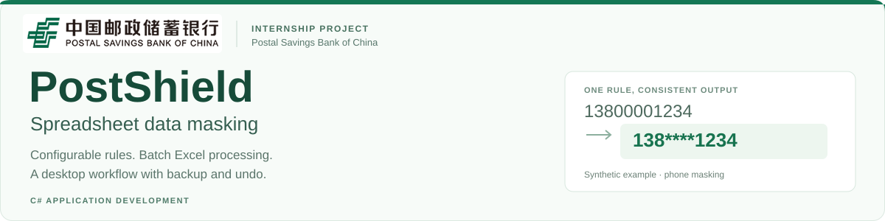
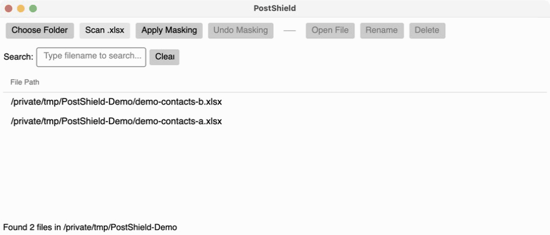
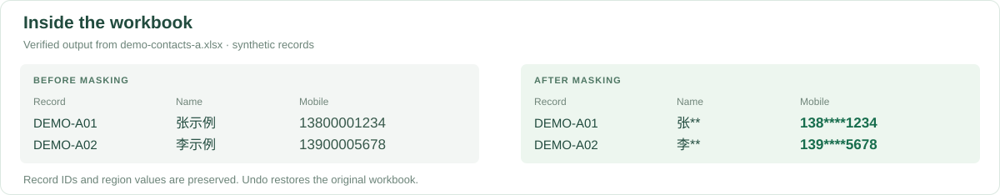
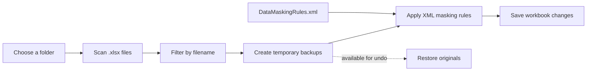

<p align="center">
  
</p>

<p align="center">
  
  
  
  
</p>

<p align="center">
  <a href="#the-internship-project">The project</a> ·
  <a href="#see-the-workflow">Demo</a> ·
  <a href="#engineering-decisions">Engineering</a> ·
  <a href="#run-locally">Run locally</a>
</p>

## The internship project

**PostShield is a software project from my internship at Postal Savings Bank of China.** It brings a spreadsheet data-masking task into one desktop workflow: find the relevant Excel files, apply configurable rules, and recover the originals when an operation needs to be undone.

The project connects three parts of the work:

| Starting point | Engineering work | Implemented result |
| --- | --- | --- |
| Different identifiers need different treatment. | Separate matching patterns and masking templates into XML configuration. | One processing loop applies field-specific rules to matching text cells. |
| Files can be spread across folders. | Combine recursive Excel scanning, filename search, and batch processing in an Avalonia interface. | Users can process the workbooks currently shown in the list. |
| Applying a mask changes a workbook. | Create a temporary backup before writing changes and provide an undo action. | The latest batch can be restored while its backups remain available. |

The engineering scope spans **C# application logic, XAML interface development, Excel processing, configurable rules, and file-operation recovery**.

## See the workflow



<sub>Actual application captures on macOS, using the synthetic workbooks included in <a href="./examples/">examples/</a>.</sub>

1. **Choose Folder** selects the directory to work on.
2. **Scan .xlsx** discovers workbooks in that directory and its subfolders.
3. **Search** filters filenames. Clear the search to include the full list again.
4. **Apply Masking** backs up and processes the workbooks currently listed.
5. **Undo Masking** restores the previous contents from those backups.

The interface also provides file opening, renaming, and deletion.

### What changes inside a workbook



The example above was read back from a workbook processed by the application. The phone rule preserves the first three and last four digits; the name rule preserves the first character.

## Engineering decisions



| Decision | Purpose | Current boundary |
| --- | --- | --- |
| **Rules outside the interface** | Edit patterns and masks in [DataMaskingRules.xml](./PostShieldDesktop/Config/DataMaskingRules.xml). | Rules run in order; the first match determines the mask. |
| **Text-cell matching** | Apply predictable character templates to identifiers. | Only string-valued cells are processed. Numeric cells are skipped. |
| **Process the visible list** | Let a filename search narrow the operation. | Processing is synchronous; large batches may block the interface. |
| **Back up before writing** | Provide an immediate recovery path. | Changes are saved to the original workbooks, and backups are temporary. |
| **Avalonia with .NET** | Use C# and XAML for a desktop interface. | This walkthrough was verified on macOS; Windows and Linux are not verified here. |

### How a masking template works

In a template, `#` copies the next input character and `*` replaces it:

```text
Input       13800001234
Template    ###****####
Output      138****1234
```

The default configuration includes patterns for Chinese mobile numbers, identity numbers, email addresses, and Chinese names. The included demonstration verifies **mobile numbers and names**.

## Project outcome

The repository contains a runnable desktop application connecting **file discovery, rule-driven Excel masking, and backup-based undo**.

The included demonstration was checked against the application:

- Both sample workbooks were processed successfully.
- A filename search narrowed the list from two files to one.
- All four sample names and mobile numbers produced the expected masks.
- Sample record IDs and region values were preserved.
- Undo restored both workbooks byte for byte.

These checks document the sample workflow. They are not production-scale performance measurements.

## Run locally

Install the [.NET 8 SDK](https://dotnet.microsoft.com/en-us/download/dotnet/8.0), then:

```bash
git clone https://github.com/niccChen/postal-savings-bank-Postshield.git
cd postal-savings-bank-Postshield/PostShieldDesktop
dotnet restore
dotnet run
```

Run from `PostShieldDesktop/` so the application resolves `Config/DataMaskingRules.xml` correctly. NuGet restores the Avalonia and EPPlus dependencies automatically.

For a first run, copy the two files from [examples/](./examples/) into a separate working folder, select that folder in the application, and follow the walkthrough above.

**Masking modifies the selected workbooks in place.** Undo is available for the latest batch in the current session. Starting another masking batch or changing folders clears the tracked backups; old temporary backups are also cleaned up. Keep an independent original when working beyond the supplied examples.

| Dependency | Version in this repository |
| --- | --- |
| Target framework | .NET 8 (`net8.0`) |
| Avalonia UI | 11.1.3 |
| EPPlus | 7.0.0 |

Build and demo verified on macOS 15.1 (Apple Silicon), with SDK 9.0.300 targeting .NET 8 and runtime 8.0.16.

## Current scope and next steps

- **Input scope:** `.xlsx` workbooks and string-valued cells. OCR, images, PDFs, and other document formats are outside this version.
- **Rule behavior:** anchored patterns match an entire cell. Free-text extraction, numeric-cell handling, and identifier validation need separate treatment.
- **Email handling:** the current email template truncates the address and does not preserve the domain. It needs revision before use as a general email-masking rule.
- **Recovery:** undo uses temporary local backups rather than persistent version history. Backup naming and interrupted-session recovery are areas to strengthen.
- **Responsiveness:** background processing and cancellation would improve large-batch use.

The application performs masking rather than cryptographic encryption. The current startup code configures EPPlus with `LicenseContext.NonCommercial`; see the [EPPlus licensing information](https://epplussoftware.com/LicenseOverview) when evaluating other usage contexts.

## Repository map

```text
PostShieldDesktop/
  MainWindow.axaml                 Desktop interface
  MainWindow.axaml.cs              Scanning, search, masking, backup, and undo
  Config/DataMaskingRules.xml      Matching patterns and masking templates
  PostShield.csproj                .NET and package dependencies
examples/                         Synthetic workbooks and demo instructions
docs/assets/                      Project identity and application captures
```

---

<sub>Project by <a href="https://github.com/niccChen">Yiyun (Nicole) Chen</a>. The PSBC wordmark identifies the internship organization. Visual sources are listed in <a href="./docs/ASSETS.md">asset credits</a>.</sub>
